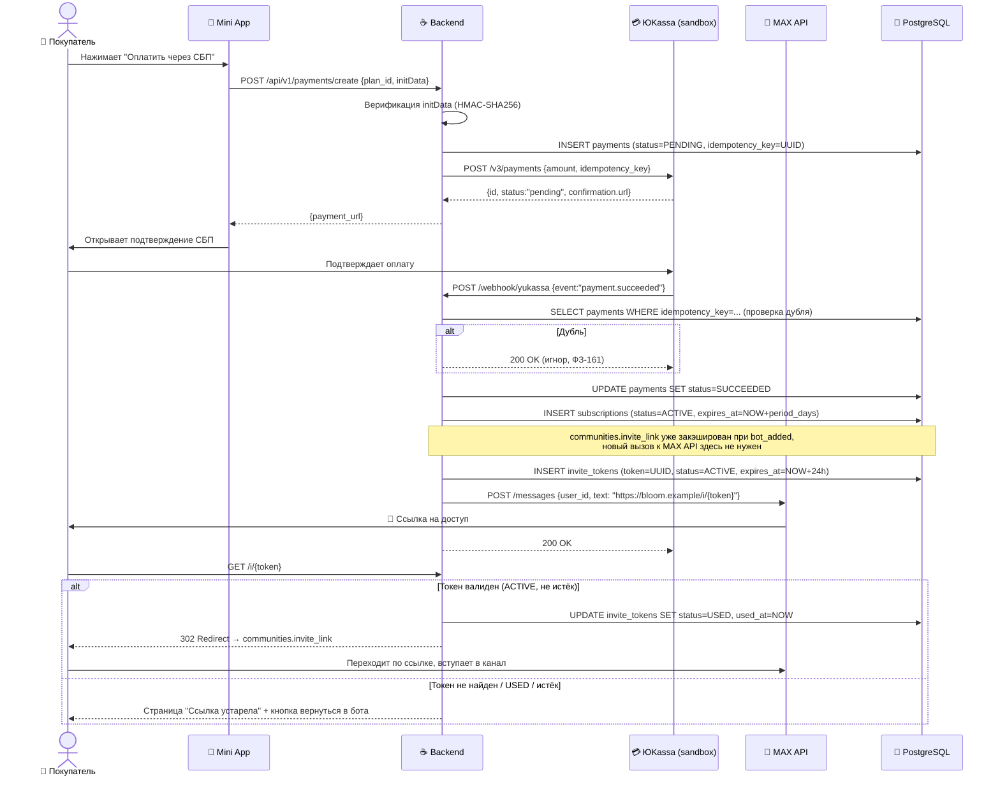
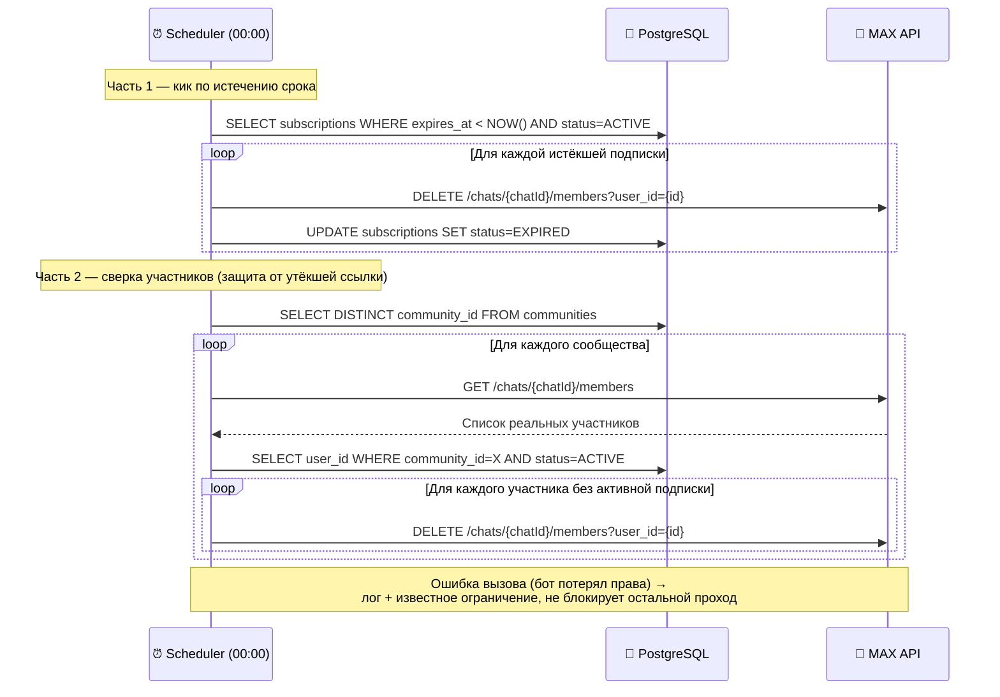
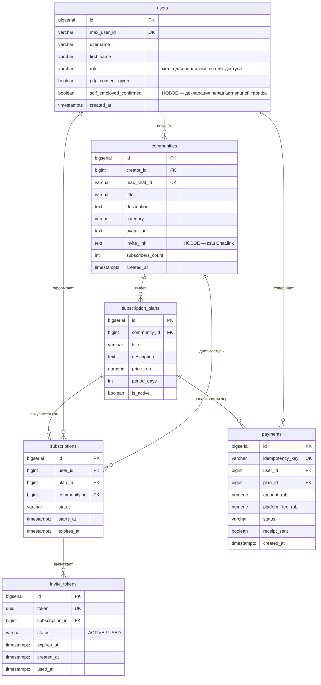

# MAX Bloom — Диаграммы (v2, актуальные)

> Заменяют соответствующие диаграммы в `07_08_09_architecture.md` и `10_database.md` — те основаны на несуществующем методе MAX API (`POST /chats/{chatId}/links`). Остальные диаграммы в тех файлах (state-диаграммы подписки/платежа, component diagram, deployment) актуальности не потеряли.

---

## 1. Sequence — Оплата и выдача доступа (актуальная механика)

---

## 2. Sequence — Ежедневный шедулер (кик + сверка участников)

---

## 3. ER-диаграмма — обновлённая (с учётом дополнений к 10_database.md)

